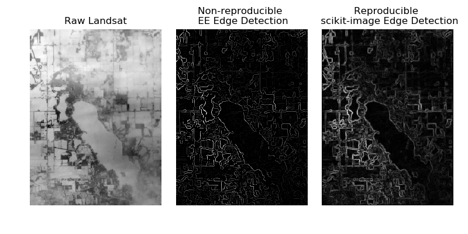

# Are Google Earth Engine anaylses reproducible?

## Setup

```
conda env create -n earthengine -f environment.yml
source activate earthengine
earthengine authenticate
```

## Execute

```
python 00_reproducible.py
python 01_reproducible.py
```

## Results


