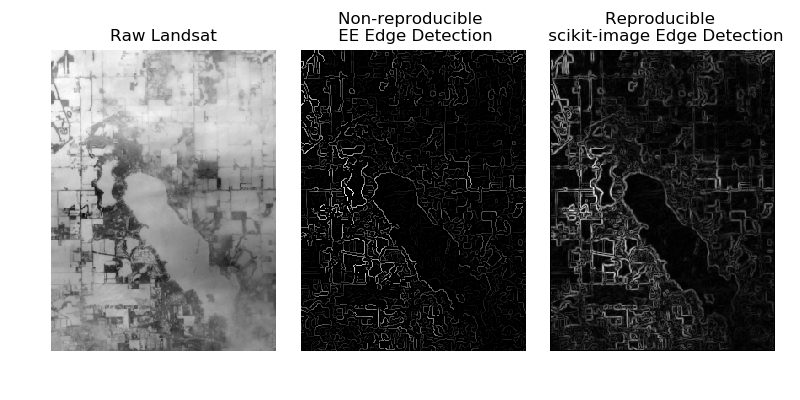

# Are Google Earth Engine analyses reproducible?

> Detailed setup files and runnable python scripts for reproducing this blog post are at: https://github.com/jsta/earthengine

More and more research papers are making use of Google Earth Engine (EE) to do geocomputation with gridded data and satellite (remote sensing) output. Are these analyses reproducible? Will they be reproducible in 2-3 years? In the following blog post, I explore these questions and conclude that:

* If a paper uses EE to simply pull/crop/extract data they answer is likely yes. 

* If a paper uses any computation functions then the analyses have a hard dependency on the EE remote servers. Should they go away, the paper will no longer be reproducible. 

## Dependencies

Before we begin let's set up our python environment and initialize EE where [python dependencies](environment.yml) are:

- python=3.7.3
- earthengine-api        
- pydrive
- numpy
- scikit-image        

```shell
$ earthengine authenticate
```

## Walkthrough

First, we must manually initialize EE and setup `pydrive` in a python session:

```python
ee.Initialize()
gauth = GoogleAuth()
gauth.LocalWebserverAuth()
drive = GoogleDrive(gauth)
```

Then, we need to identify an [EE image product](https://developers.google.com/earth-engine/datasets/). We will focus on the Landsat 8 panchromatic band product and select a tile overlapping Gull Lake Michigan (path: 21, row: 31, date: 2019-01-26). You can find the path and row numbers for an arbitrary region of interest using [this tool](https://landsat.usgs.gov/landsat_acq#convertPathRow). The scenario here is that we will attempt to extract the coastline of Gull Lake using an EE workflow. Note that we save the raw Landsat scene to Google Drive clipped to a bounding box around the Gull Lake watershed using the `region` argument of `batch.Export.image.toDrive`.

```python
image = ee.Image('LANDSAT/LC08/C01/T1/LC08_021031_20190126').select('B8')
raw_export = batch.Export.image.toDrive(image, description = 'raw_export', 
                                        scale = 30,
                                        region=([-85.4664, 42.36926],
                                        [-85.37169, 42.36926],
                                        [-85.37169, 42.46446],
                                        [-85.4664, 42.46446],
                                        [-85.4664, 42.36926]))
batch.Task.start(raw_export)
```

Next, we can pull the results from Drive to our local machine using some `pydrive` commands:

```python
file_list = drive.ListFile({'q': "'root' in parents and trashed=false"}).GetList()
file_position = np.min(np.where(
    [file1['title'] == "raw_export.tif" for file1 in file_list]))
file_id = file_list[file_position]['id']
file1 = drive.CreateFile({'id':file_id})
file1.GetContentFile('raw_export.tif')
```

Now, let's find the _edges_ of our scene using a non-reproducible EE workflow:

```python
canny = ee.Algorithms.CannyEdgeDetector(image, 10, 1)
canny_export = batch.Export.image.toDrive(canny, description = 'canny', 
                                scale = 30,
                                region=([-85.4664, 42.36926],
                                [-85.37169, 42.36926],
                                [-85.37169, 42.46446],
                                [-85.4664, 42.46446],
                                [-85.4664, 42.36926]))
batch.Task.start(canny_export)

# pull file from GDrive
file_list = drive.ListFile({'q': "'root' in parents and trashed=false"}).GetList()
file_position = np.min(np.where(
    [file1['title'] == "canny.tif" for file1 in file_list]))
file_id = file_list[file_position]['id']
file1 = drive.CreateFile({'id':file_id})
file1.GetContentFile('canny.tif')
```

Finally, let's find the _edges_ of our scene using a reproducible `scikit-image`:

```python
raw_export = skimage.io.imread('raw_export.tif')
edge_sobel = skimage.filters.sobel(raw_export)
```

Here is a comparison of the raw data with the results of each approach:



## Recommendation

**Use EE as a remote data source not a computation platform.**

## Notes about EE

* It's obnoxious that there seems to be no way to read the argument descriptions of EE functions without going to the online code editor. Also, the code editor docs don't have embedded examples. You need to browse a separate webpage.

* I was able to reproduce [EE data fetching code](https://github.com/acgeospatial/GoogleEarthEnginePy/blob/master/OrderData.py) from 2016 that uses legacy formatting of Landsat file names.

* `gdal` has [tools](https://www.gdal.org/drv_eeda.html) for finding and downloading from EE!

## Further reading

https://geohackweek.github.io/raster/04-workingwithrasters/

https://gis.stackexchange.com/a/297042/32531

https://geoscripting-wur.github.io/Earth_Engine/
